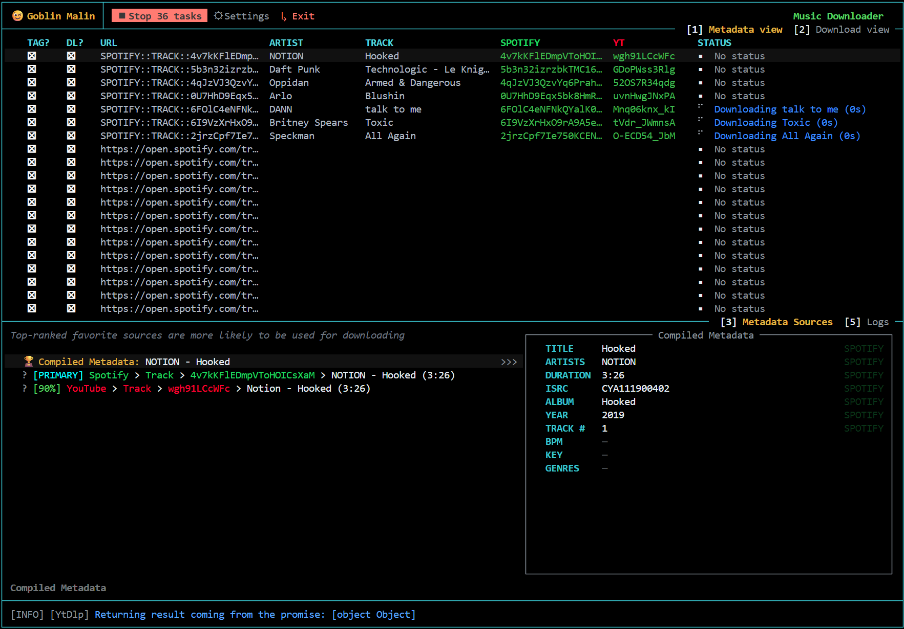
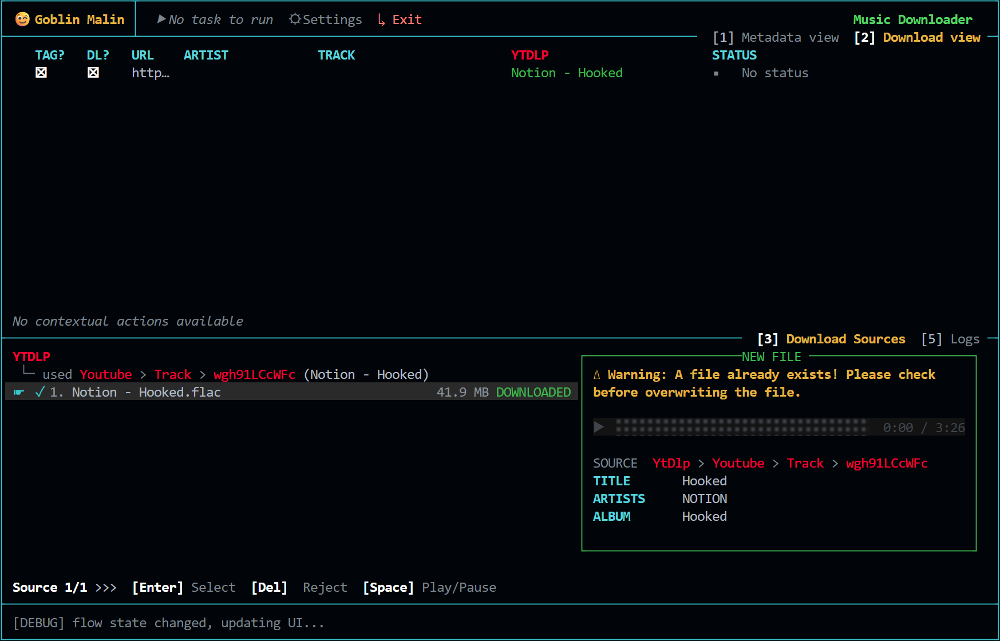

# goblin-malin 😉

- [goblin-malin 😉](#goblin-malin-)
    - [Installation](#installation)
        - [Installation with `npm` (RECOMMENDED)](#installation-with-npm-recommended)
        - [Installation with `yarn`](#installation-with-yarn)
        - [Installation with `pnpm`](#installation-with-pnpm)
        - [Installation on Windows](#installation-on-windows)
    - [Steps](#steps)
    - [Running the project as a developer](#running-the-project-as-a-developer)
    - [Launching the app through js code](#launching-the-app-through-js-code)
    - [Screenshots](#screenshots)
        - [Metadata view](#metadata-view)
        - [Download view](#download-view)

> [!CAUTION]
> **This project is in early, early, early development.**<br>
> Be aware that the data model can change drastically, making previous versions incompatible with the current one. Use at your own risk 😉

A keyboard-driven terminal UI for downloading and tagging music tracks with metadata. Import links from Spotify, YouTube, the app cross-references metadata across providers, finds the best download source (only yt-dlp for now), and saves it to disk with clean tags.

## Installation

### Installation with `npm` (RECOMMENDED)

1. Install [Node.js](https://nodejs.org/en/download) with `npm`
2. Install with `npm`
    ```bash
    npm install -g goblin-malin
    goblin-malin # Run application
    ```

### Installation with `yarn`

```bash
yarn global add goblin-malin
```

<details>
<summary>Don't forget to add your `yarn` directory to your PATH to have the command `goblin-malin` available in any terminal.</summary>

On windows:

```ps1
$yarBin = "C:\Users\YOUR_USERNAME\AppData\Local\Yarn\bin"
$current = [System.Environment]::GetEnvironmentVariable("PATH", "User")
[System.Environment]::SetEnvironmentVariable("PATH", "$current;$yarBin", "User")
```

</details>

### Installation with `pnpm`

```bash
pnpm add -g  goblin-malin
```

### Installation on Windows

[](https://github.com/Tetraxel/goblin-malin/releases/latest/download/goblin-malin-win-x64.exe)

```bash
goblin-malin.exe
```

## Steps

- Import with `Ctrl+V` URLs from compatible streaming platforms :
    - `Spotify` (requires Spotify Premium Account to have full metadata)
    - `YouTube`
- System fetches primary metadata from the corresponding URL platform
- System discovers the same track on other platforms (cross-referencing via ISRC or track/artist name)
- Filters/orders metadata sources by relevance or leaves the default ranking chosen by the system (use `TAB` key to switch the focused window).
- System downloads matching tracks from available download providers:
    - `yt-dlp`
- User selects the best download source and previews the audio
- User saves the file to the desired folder with embedded tags

## Running the project as a developer

You can run the project as a developer:

1. Clone the repository and open a terminal in the project directory
2. Install [Node.js](https://nodejs.org/en/download) and [yarn](https://classic.yarnpkg.com/lang/en/docs/install)
3. Install dependencies in the project directory: `yarn install`
4. Run the application: `yarn run dev`

## Launching the app through js code

> Not customizable yet

```js
import GoblinMalin from "goblin-malin";

GoblinMalin.start();
```

## Screenshots

### Metadata view



### Download view


